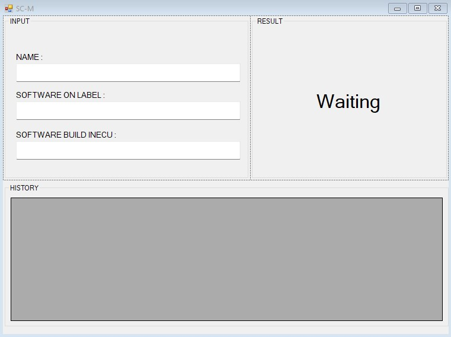

# Program checking compare data

This is a simple compare text data

## How to use
1. Database: SQLite
2. IDE: Visual Studio 2022

## How to run
1. Open the solution in Visual Studio
2. Build the solution
3. Run the solution

<!-- Photo -->
## Image
 
 

    

